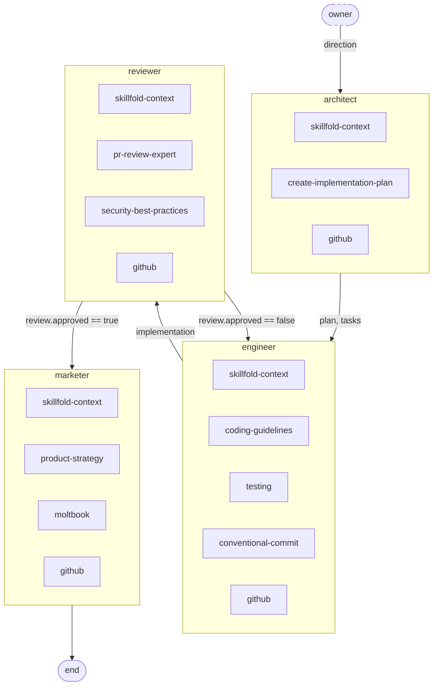

<div align="center">

# Skillfold

**Typed coordination for multi-agent pipelines**

[](https://www.npmjs.com/package/skillfold)
[](https://github.com/byronxlg/skillfold/actions/workflows/ci.yml)
[](LICENSE)

</div>

You have a dozen agents in scattered Markdown files. How do you know they're wired correctly? How do you validate that Agent A's output types match Agent B's input? How do you catch cycles or unreachable nodes before runtime?

Native platforms make it easy to define individual agents and skills. What they don't solve is the coordination layer between agents: typed state, execution flows, conditional routing, and compile-time validation. Skillfold fills that gap. Declare your pipeline in YAML, validate it at compile time, and output native [SKILL.md](https://agentskills.io/specification) files for every agent. No runtime, no daemon, no SDK.

## The Problem

You wire three agents together by hand. The engineer writes `state.code`, the reviewer reads it, and a conditional routes back on failure. Everything lives in separate Markdown files with no shared schema, no validation, and no way to check correctness before you run it.

- Does the reviewer actually read the field the engineer writes?
- If you rename a state field, which agents break?
- Is there a path from every node to `end`, or did you leave one dangling?
- Can two agents write the same field in parallel?

These are coordination problems, and they only get worse as the pipeline grows.

## The Fix

Declare everything in one YAML config. The compiler validates it at compile time and outputs native agent files.

```yaml
# skillfold.yaml
skills:
  atomic:
    planning: ./skills/planning
    coding: ./skills/coding
    review: ./skills/review
  composed:
    engineer:
      compose: [planning, coding]
      description: "Implements the plan and writes tests."
    reviewer:
      compose: [review]
      description: "Reviews code for correctness and quality."

state:
  Review:
    approved: bool
    feedback: string
  code: { type: string }
  review: { type: Review }

team:
  flow:
    - engineer:
        writes: [state.code]
      then: reviewer
    - reviewer:
        reads: [state.code]
        writes: [state.review]
      then:
        - when: review.approved == false
          to: engineer
        - when: review.approved == true
          to: end
```

```bash
npx skillfold
```

The compiler checks that every state read has a matching write, every transition target exists, every cycle has an exit condition, and no two agents write the same field in parallel. If anything is wrong, you get an error at build time instead of a broken pipeline at runtime.

## Beyond Composition

Skillfold's own dev team is compiled from this repo's [`skillfold.yaml`](skillfold.yaml) - 5 flow nodes (including an async human owner), 7 composed agents, with a review loop and conditional routing. Generated by `skillfold graph`:


---

## Quick Start

```bash
npx skillfold init my-team   # scaffold a starter pipeline
cd my-team
npx skillfold                # compile it
```

For a step-by-step walkthrough, see the [Getting Started](docs/getting-started.md) guide. To compile directly to your platform, see the [Integration Guide](docs/integrations.md).

> [!TIP]
> Add `team.orchestrator: orchestrator` and the orchestrator's compiled SKILL.md gets a generated execution plan with numbered steps, state tables, and conditional branches.

<details>
<summary><strong>See it in action</strong></summary>

```
$ npx skillfold init demo --template dev-team
skillfold: project initialized
  -> skillfold.yaml

Next: cd demo && npx skillfold

$ cd demo && npx skillfold --target claude-code
skillfold: compiled dev-team
  -> .claude/skills/planner/SKILL.md
  -> .claude/skills/engineer/SKILL.md
  -> .claude/skills/reviewer/SKILL.md
  -> .claude/skills/orchestrator/SKILL.md
  -> .claude/agents/planner.md
  -> .claude/agents/engineer.md
  -> .claude/agents/reviewer.md
  -> .claude/commands/run-pipeline.md
  3 agents, 5 skills (2 shared). ~79 lines deduplicated.

$ ls .claude/agents/
engineer.md    planner.md    reviewer.md

$ head -20 .claude/agents/engineer.md
<!-- Generated by skillfold v1.10.0 from dev-team (skillfold.yaml). Do not edit directly. -->
---
name: engineer
description: Implements the plan by writing production code and tests.
model: inherit
color: green
---

# engineer

Implements the plan by writing production code and tests.

## Reads

- `state.plan`

## Writes

- `state.implementation`

$ npx skillfold list
dev-team

Skills (11 atomic, 3 composed):
  planning             (atomic)
  research             (atomic)
  decision-making      (atomic)
  code-writing         (atomic)
  code-review          (atomic)
  testing              (atomic)
  writing              (atomic)
  summarization        (atomic)
  github-workflow      (atomic)
  file-management      (atomic)
  skillfold-cli        (atomic)
  planner              = planning + decision-making
  engineer             = planning + code-writing + testing
  reviewer             = code-review + testing

State (3 fields, 1 types):
  plan                 string
  implementation       string
  review               Review
  Review { approved: bool, feedback: string }

Team Flow:
  planner -> engineer
  engineer -> reviewer
  reviewer -> end (when review.approved == true)
  reviewer -> engineer (when review.approved == false)
```

</details>

---

## What the Compiler Validates

Every `npx skillfold` run checks the full pipeline at compile time:

- **State type matching** - reads and writes reference fields declared in the state schema
- **Transition targets** - every `then` points to a real agent or `end`
- **Cycle exit conditions** - loops have at least one conditional path to `end`
- **Reachability** - no orphaned nodes or dead-end agents
- **Write conflicts** - no two agents write the same state field in parallel
- **Reference integrity** - every skill name in a composition exists

If anything fails, you get a clear error with the skill name and the problem. No silent runtime failures.

---

## How Is This Different?

Skillfold is **not** a runtime framework (like CrewAI or LangGraph). It is **not** a replacement for native agent definitions (like Claude Code subagents or Cursor rules). It is a compiler that adds a coordination type system on top of platform-native primitives.

Think of it like TypeScript for agent pipelines. TypeScript doesn't replace JavaScript - it adds a type system that catches errors at compile time. Skillfold doesn't replace SKILL.md files - it adds typed state, flow validation, and orchestrator generation, then compiles down to the same Markdown your platform already reads.

**What native platforms give you:** Define agents, attach skills, run them.

**What they don't give you:** A way to declare that Agent A writes `state.code`, Agent B reads it, and the transition is conditional on `review.approved`. A way to validate that every state path exists, every transition target is reachable, and no two agents write the same field in parallel. A way to generate an orchestrator plan from a flow definition instead of writing it by hand.

That coordination layer is what skillfold provides.

Skill management tools like the [skills CLI](https://skills.sh) handle installing and updating individual SKILL.md files. Skillfold handles what comes after: composing multiple skills into coherent agents, declaring what each agent reads and writes, and validating the entire pipeline at compile time. You can use both together - reference your existing skills by path or GitHub URL, and skillfold composes and validates them.

---

## Already Using Claude Code?

Adopt your existing agents and start adding typed coordination:

```bash
npx skillfold adopt                  # import .claude/agents/ into a skillfold config
npx skillfold --target claude-code   # compile back to native subagents, skills, and commands
```

```
.claude/
  agents/
    engineer.md
    reviewer.md
  skills/
    engineer/SKILL.md
    reviewer/SKILL.md
  commands/
    run-pipeline.md       # generated orchestrator from team flow
```

Your agents keep working exactly as before. Now you can layer on state schemas, execution flows, and compile-time validation. The `/run-pipeline` command is generated from the flow definition - no hand-written orchestration.

See the [Integration Guide](docs/integrations.md) for setup details. Works with [Claude Code](https://claude.ai/code), [Cursor](https://cursor.com), [VS Code](https://code.visualstudio.com), [GitHub Copilot](https://github.com), [OpenAI Codex](https://developers.openai.com/codex), [Gemini CLI](https://geminicli.com), and [26 more](https://agentskills.io).

---

## Works with Agent Teams

Skillfold owns the config; Agent Teams owns the runtime. Skillfold compiles agent definitions, state schemas, and flow graphs into plain Markdown at build time. Agent Teams picks up those files at execution time to coordinate live sessions and distribute parallel work. The two tools are complementary.

---

## How It Works

Three sections in one YAML config, each building on the last:

| Section | What you define | What the compiler does |
|---------|----------------|----------------------|
| **skills** | Atomic skill directories + composition rules | Concatenates skill bodies in order, recursively |
| **state** | Typed schema with custom types and external locations | Validates reads/writes against the flow |
| **team** | Execution flow with conditionals, loops, and parallel map | Generates orchestrator plan, checks reachability |

Compiled output is portable across [32 platforms](https://agentskills.io) that support the Agent Skills standard.

Here's the example above as a flow diagram (`skillfold graph`):


<details>
<summary><strong>Generated orchestrator output</strong></summary>

```markdown
## Execution Plan

### Step 1: engineer
Invoke **engineer**.
Writes: `state.code`
Then: proceed to step 2.

### Step 2: reviewer
Invoke **reviewer**.
Reads: `state.code`
Writes: `state.review`
Then:
- If `review.approved == false`: go to step 1
- If `review.approved == true`: end
```

</details>

---

## Features

### Typed State Schemas

Custom types, primitives, and `list<Type>`. The compiler validates that every read has a matching write, detects write conflicts, and maps state to external locations. Built-in integrations for GitHub issues, discussions, and pull requests generate validated URLs and orchestrator instructions automatically. For custom services, a top-level `resources` section declares namespace URLs for compile-time path validation.

```yaml
state:
  Task:
    description: string
    approved: bool
  tasks:
    type: "list<Task>"
    location:
      github-issues:
        repo: myorg/myrepo
        label: task
```

### Execution Flows

Conditional routing with `when` expressions. Loops with required exit conditions. Parallel `map` over typed lists. Reachability analysis for all nodes. Flow nodes can reference external pipeline configs via `flow:` for nested sub-flow composition. Mark nodes `async: true` with a policy (`block`, `skip`, `use-latest`) for external agents like humans, CI systems, or other teams.

```yaml
team:
  flow:
    - owner:
        async: true
        writes: [state.direction]
        policy: block
      then: planner
    - planner:
        writes: [state.tasks]
      then:
        map: state.tasks
        as: task
        agent: worker
        then: reviewer
```

### Skill Composition

Atomic skills are reusable instruction fragments. Composed skills concatenate them in order, recursively. Define each skill once and share it across agents.

```yaml
composed:
  tech-lead:
    compose: [planning, code-review]       # bodies joined in order
  senior-eng:
    compose: [tech-lead, code-writing]     # recursive - includes planning + code-review + code-writing
```

### Remote Skills and Imports

Reference skills by GitHub URL, npm package, or import them from other configs. Team flows stay local.

```yaml
skills:
  atomic:
    shared: https://github.com/org/repo/tree/main/skills/shared
    planning: npm:skillfold-skill-planning    # resolve from npm package
imports:
  - npm:skillfold/library/skillfold.yaml      # npm: prefix (preferred)
  - node_modules/skillfold/library/skillfold.yaml  # direct path (also works)
```

> [!TIP]
> Set `GITHUB_TOKEN` in your environment to fetch skills from private repositories.

### Graph Visualization

`skillfold graph` outputs a Mermaid flowchart showing full composition lineage and state writes. Use `--html` for an interactive HTML page with clickable nodes, a composition details sidebar, and SVG export.

---

## Shared Library

Skillfold ships with **11 generic skills** you can import into any pipeline:

| Skill | Purpose |
|-------|---------|
| planning | Break problems into steps, identify dependencies |
| research | Gather information, evaluate sources |
| decision-making | Evaluate trade-offs, justify recommendations |
| code-writing | Write clean, production-quality code |
| code-review | Review for correctness, clarity, security |
| testing | Write and reason about tests, edge cases |
| writing | Produce clear, structured prose |
| summarization | Condense information for target audiences |
| github-workflow | Work with branches, PRs, issues via `gh` CLI |
| file-management | Read, create, edit, and organize files |
| skillfold-cli | Use the skillfold compiler to manage pipeline configs |

Three ready-made example configs are included as templates:

| Template | Pattern |
|----------|---------|
| **dev-team** | Linear pipeline with review loop (planner, engineer, reviewer) |
| **content-pipeline** | Map/parallel pattern over topics (researcher, writer, editor) |
| **code-review-bot** | Minimal two-agent flow (analyzer, reporter) |

Start from any template with `skillfold init --template <name>`:

```bash
npx skillfold init my-team --template dev-team
```

---

## Self-Hosting

Skillfold builds its own dev team. The [`skillfold.yaml`](skillfold.yaml) in this repo defines 7 composed agents (strategist, architect, designer, marketer, engineer, reviewer, orchestrator) with 5 flow nodes - starting from an async human owner who sets direction, through architect, engineer, and reviewer (with a review loop), ending at marketer.

State is mapped to real infrastructure: plans live in GitHub Discussions, tasks become GitHub Issues, implementations are pull requests, and reviews are PR reviews. Browse the [Discussions](https://github.com/byronxlg/skillfold/discussions), [Issues](https://github.com/byronxlg/skillfold/issues?q=label%3Atask), and [Pull Requests](https://github.com/byronxlg/skillfold/pulls?q=is%3Apr) to see the pipeline's output.

The full team flow, generated by `skillfold graph`:



---

## Reference

### Install

```bash
npm install -g skillfold    # global install
npx skillfold               # or run directly
```

Requires Node.js 20+. Single dependency: `yaml`.

**Claude Code plugin marketplace:** Install the skills library and `/skillfold` command directly in Claude Code:

```
/plugin marketplace add byronxlg/skillfold
/plugin install skillfold@skillfold
```

### CLI

```
skillfold [command] [options]

Commands:
  init [dir]        Scaffold a new pipeline project
  adopt             Adopt existing Claude Code agents into a pipeline
  validate          Validate config without compiling
  list              Display a structured summary of the pipeline
  graph             Output Mermaid flowchart of the team flow
  watch             Compile and watch for changes
  plugin            Package compiled output as a Claude Code plugin
  search [query]    Discover skill packages on npm
  (default)         Compile the pipeline config

Options:
  --config <path>      Config file (default: skillfold.yaml)
  --out-dir <path>     Output directory (default: build, or .claude for claude-code target)
  --dir <path>         Target directory for init (default: .)
  --target <mode>      Output mode: skill (default) or claude-code
  --template <name>    Start from a library template (init only)
  --html               Output interactive HTML instead of Mermaid (graph only)
  --check              Verify compiled output is up-to-date (exit 1 if stale)
  --help               Show this help
  --version            Show version
```

### CI Integration

Add skillfold's `--check` flag to CI so stale compiled output fails the build. The repo ships a reusable GitHub Action:

```yaml
name: Skillfold
on: [push, pull_request]
jobs:
  check:
    runs-on: ubuntu-latest
    steps:
      - uses: actions/checkout@v4
      - uses: actions/setup-node@v4
        with:
          node-version: '20'
      - run: npm ci
      - uses: byronxlg/skillfold@v1
```

### Config

Three top-level sections. Full specification in [BRIEF.md](BRIEF.md). A [JSON Schema](skillfold.schema.json) is available for IDE autocompletion.

Add this line to the top of your `skillfold.yaml` for editor support:

```yaml
# yaml-language-server: $schema=node_modules/skillfold/skillfold.schema.json
```

### Tests

```bash
npm test          # node:test, no extra dependencies
npx tsc --noEmit  # type check
```

## License

MIT
