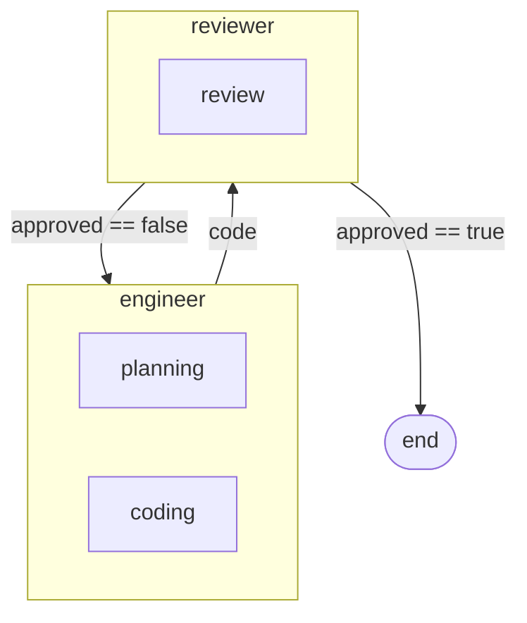

<div align="center">

# Skillfold

**Compiler for multi-agent AI pipelines**

[](https://www.npmjs.com/package/skillfold)
[](https://github.com/byronxlg/skillfold/actions/workflows/ci.yml)
[](LICENSE)

</div>

Running multiple AI agents? Each one needs a [SKILL.md](https://agentskills.io/specification) - and when agents share skills, you end up copy-pasting instructions between them. Change one skill, manually update every agent that uses it.

Skillfold fixes this. Define each skill once, compose them into agents, and compile one YAML config into a spec-compliant SKILL.md for every agent.

```bash
npx skillfold init my-team   # scaffold a starter pipeline
cd my-team
npx skillfold                # compile it
```

```
build/
  planner/SKILL.md       # planning body
  engineer/SKILL.md      # planning + coding bodies, composed
  reviewer/SKILL.md      # reviewing body
  orchestrator/SKILL.md  # planning body + generated execution plan
```

Works with [Claude Code](https://claude.ai/code), [Cursor](https://cursor.com), [VS Code](https://code.visualstudio.com), [GitHub Copilot](https://github.com), [OpenAI Codex](https://developers.openai.com/codex), [Gemini CLI](https://geminicli.com), and [26 more](https://agentskills.io).

<div align="center">

[Already using Claude Code?](#already-using-claude-code) | [Quick Start](#quick-start) | [Claude Code](#claude-code) | [How Is This Different?](#how-is-this-different) | [How It Works](#how-it-works) | [Features](#features) | [Library](#shared-library) | [Integrations](docs/integrations.md) | [Reference](#reference)

</div>

## Already Using Claude Code?

If you have agents in `.claude/agents/`, skillfold can adopt them:

```bash
npx skillfold adopt
```

This reads your existing agent files, creates a skill directory for each one, and generates a `skillfold.yaml` config. Your agents keep working exactly as before - now you can start extracting shared instructions into reusable skills that the compiler keeps in sync.

---

## Quick Start

For a step-by-step walkthrough, see the [Getting Started](docs/getting-started.md) guide. To compile directly to your platform, see the [Integration Guide](docs/integrations.md).

Define skills, compose them into agents, wire agents into a team flow, and compile:

```yaml
# skillfold.yaml
name: dev-team

skills:
  atomic:
    planning: ./skills/planning
    coding: ./skills/coding
    review: ./skills/review
  composed:
    engineer:
      compose: [planning, coding]
      description: "Implements the plan and writes tests."
    reviewer:
      compose: [review]
      description: "Reviews code for correctness."

state:
  Review:
    approved: bool
    feedback: string
  code: { type: string }
  review: { type: Review }

team:
  flow:
    - engineer:
        writes: [state.code]
      then: reviewer
    - reviewer:
        reads: [state.code]
        writes: [state.review]
      then:
        - when: review.approved == false
          to: engineer
        - when: review.approved == true
          to: end
```

```bash
npx skillfold
```

```
build/
  engineer/SKILL.md    # planning + coding bodies, YAML frontmatter
  reviewer/SKILL.md    # review body, YAML frontmatter
```

The `engineer` agent's SKILL.md contains the concatenated bodies of `planning` and `coding`. Every output file is a valid SKILL.md per the [Agent Skills standard](https://agentskills.io/specification).

> [!TIP]
> Add `team.orchestrator: orchestrator` and the orchestrator's compiled SKILL.md gets a generated execution plan with numbered steps, state tables, and conditional branches.

---

## Claude Code

Compile directly to Claude Code's native agent and skill layout:

```bash
npx skillfold --target claude-code
```

```
.claude/
  agents/
    engineer.md
    reviewer.md
  skills/
    engineer/SKILL.md
    reviewer/SKILL.md
```

Skillfold also ships a built-in Claude Code plugin at `node_modules/skillfold/plugin/` with the shared library skills and a `/skillfold` slash command. To package your own pipeline as a distributable plugin:

```bash
npx skillfold plugin
```

See the [Integration Guide](docs/integrations.md) for setup details.

---

## How Is This Different?

Agent Skills tools solve different problems at different layers:

| Layer | What it does | Examples |
|-------|-------------|----------|
| **Skill authoring** | Define individual skills, ship them with packages | TanStack Intent, manual SKILL.md |
| **Composition and orchestration** | Compose skills into agents, wire agents into typed team flows, compile output | **Skillfold** |
| **Execution** | Run the agents | Claude Code, Cursor, Copilot, etc. |

Authoring tools help library maintainers *ship* skills. Skillfold helps teams *consume and orchestrate* them. A library author ships skills with their package, a team imports those skills into a skillfold pipeline, and agent platforms run the compiled output. These tools work together.

---

## How It Works

Skillfold has three layers, each building on the last:

| Layer | What you define | What the compiler does |
|-------|----------------|----------------------|
| **Skills** | Atomic skill directories + composition rules | Concatenates skill bodies in order, recursively |
| **State** | Typed schema with custom types and external locations | Validates reads/writes at compile time |
| **Team** | Execution flow with conditionals, loops, and parallel map | Generates orchestrator plan, checks reachability |

Compiled output is portable across [32 platforms](https://agentskills.io) that support the Agent Skills standard.

Here's the Quick Start example as a flow diagram (`skillfold graph`):



<details>
<summary><strong>Generated orchestrator output</strong></summary>

```markdown
## Execution Plan

### Step 1: engineer
Invoke **engineer**.
Writes: `state.code`
Then: proceed to step 2.

### Step 2: reviewer
Invoke **reviewer**.
Reads: `state.code`
Writes: `state.review`
Then:
- If `review.approved == false`: go to step 1
- If `review.approved == true`: end
```

</details>

---

## Features

**Composition** --
Atomic skills are reusable instruction fragments. Composed skills concatenate them in order, recursively. Reference remote skills by GitHub URL.

**Validation** --
Typed state schema with custom types, primitives, and `list<Type>`. State reads and writes validated at compile time. Write conflict detection. Cycle exit condition enforcement.

**Team Flows** --
Conditional routing with `when` expressions. Loops with required exit conditions. Parallel `map` over typed lists. Reachability analysis for all flow nodes.

**Graph Visualization** --
`skillfold graph` outputs a Mermaid flowchart showing full composition lineage and state writes.

**Remote Skills** --
Reference skills by GitHub URL. Skillfold fetches them at compile time.

```yaml
skills:
  atomic:
    shared: https://github.com/org/repo/tree/main/skills/shared
```

> [!TIP]
> Set `GITHUB_TOKEN` in your environment to fetch skills from private repositories.

**Pipeline Imports** --
Share skills and state across configs. Team flows stay local.

```yaml
imports:
  - node_modules/skillfold/library/skillfold.yaml
```

---

## Shared Library

Skillfold ships with **11 generic skills** you can import into any pipeline:

| Skill | Purpose |
|-------|---------|
| planning | Break problems into steps, identify dependencies |
| research | Gather information, evaluate sources |
| decision-making | Evaluate trade-offs, justify recommendations |
| code-writing | Write clean, production-quality code |
| code-review | Review for correctness, clarity, security |
| testing | Write and reason about tests, edge cases |
| writing | Produce clear, structured prose |
| summarization | Condense information for target audiences |
| github-workflow | Work with branches, PRs, issues via `gh` CLI |
| file-management | Read, create, edit, and organize files |
| skillfold-cli | Use the skillfold compiler to manage pipeline configs |

Three ready-made example configs are included as templates:

| Template | Pattern |
|----------|---------|
| **dev-team** | Linear pipeline with review loop (planner, engineer, reviewer) |
| **content-pipeline** | Map/parallel pattern over topics (researcher, writer, editor) |
| **code-review-bot** | Minimal two-agent flow (analyzer, reporter) |

Start from any template with `skillfold init --template <name>`:

```bash
npx skillfold init my-team --template dev-team
```

---

## Self-Hosting

Skillfold builds its own dev team. The [`skillfold.yaml`](skillfold.yaml) in this repo defines 7 agents:

| Agent | Role |
|-------|------|
| strategist | Assesses project needs and sets direction |
| architect | Designs systems and decomposes work into GitHub issues |
| designer | Designs project-facing content like READMEs and docs |
| marketer | Positions the project for adoption through messaging and outreach |
| engineer | Writes production TypeScript code and tests, opens PRs |
| reviewer | Reviews pull requests for correctness and clarity |
| orchestrator | Coordinates pipeline execution and merges approved PRs |

The flow runs: strategist -> architect -> engineer -> reviewer. The reviewer feeds back to the engineer when `review.approved == false`, creating a review loop that runs until code is approved.

> [!NOTE]
> State is mapped to real infrastructure: plans live in GitHub Discussions, tasks become GitHub Issues, implementations are pull requests, and reviews are PR reviews.

---

## Reference

### Install

```bash
npm install -g skillfold    # global install
npx skillfold               # or run directly
```

Requires Node.js 20+. Single dependency: `yaml`.

### CLI

```
skillfold [command] [options]

Commands:
  init [dir]        Scaffold a new pipeline project
  adopt             Adopt existing Claude Code agents into a pipeline
  validate          Validate config without compiling
  list              Display a structured summary of the pipeline
  graph             Output Mermaid flowchart of the team flow
  watch             Compile and watch for changes
  plugin            Package compiled output as a Claude Code plugin
  (default)         Compile the pipeline config

Options:
  --config <path>      Config file (default: skillfold.yaml)
  --out-dir <path>     Output directory (default: build, or .claude for claude-code target)
  --dir <path>         Target directory for init (default: .)
  --target <mode>      Output mode: skill (default) or claude-code
  --template <name>    Start from a library template (init only)
  --check              Verify compiled output is up-to-date (exit 1 if stale)
  --help               Show this help
  --version            Show version
```

### Config

Three top-level sections. Full specification in [BRIEF.md](BRIEF.md). A [JSON Schema](skillfold.schema.json) is available for IDE autocompletion.

Add this line to the top of your `skillfold.yaml` for editor support:

```yaml
# yaml-language-server: $schema=node_modules/skillfold/skillfold.schema.json
```

<details>
<summary><strong>skills</strong> - atomic paths and composition rules</summary>

```yaml
skills:
  atomic:
    code-review: ./skills/code-review                              # local path
    shared: https://github.com/org/repo/tree/main/skills/shared   # GitHub URL
  composed:
    tech-lead:
      compose: [planning, code-review]
      description: "Produces plans and reviews code."
```

</details>

<details>
<summary><strong>state</strong> - typed schema with custom types and locations</summary>

```yaml
state:
  Task:                    # custom type
    description: string
    approved: bool
  tasks:                   # typed field with external location
    type: "list<Task>"
    location:
      skill: jira
      path: DEV/dev-board
```

</details>

<details>
<summary><strong>team</strong> - orchestrator and execution flow</summary>

```yaml
team:
  orchestrator: orchestrator   # receives generated execution plan
  flow:
    - planner:
        writes: [state.plan]
      then: worker
    - worker:
        reads: [state.plan]
        writes: [state.result]
      then: end
```

Conditional transitions, parallel map, and imports are documented in [BRIEF.md](BRIEF.md).

</details>

### Tests

```bash
npm test          # node:test, no extra dependencies
npx tsc --noEmit  # type check
```

## License

MIT
