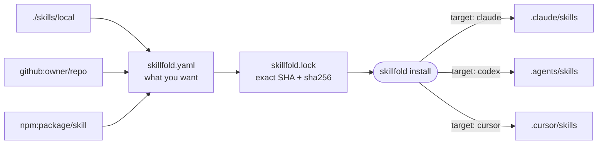

<div align="center">

# Skillfold

**Declarative skill manager for Claude Code, Codex, and Cursor**

[](https://www.npmjs.com/package/skillfold)
[](https://github.com/byronxlg/skillfold/actions/workflows/ci.yml)
[](LICENSE)

[Website](https://byronxlg.github.io/skillfold/) &middot; [Blog](https://byronxlg.github.io/skillfold/blog/) &middot; [Getting Started](docs/getting-started.md) &middot; [Manifest](docs/manifest.md) &middot; [CLI](docs/cli.md)

</div>

Your `.claude/skills` directory is state with no source of truth. Skills get pasted in from blog posts, copied between machines, edited in place, and lost on the next laptop. Nobody knows which version of a skill a teammate is running, and "works on my machine" now applies to your agent.

Skillfold treats skills like dependencies. Declare them in one YAML file, pin exact revisions in a lockfile, install them reproducibly.

```yaml
# skillfold.yaml
skills:
  commit-helper: ./skills/commit-helper
  frontend-design: github:anthropics/skills/skills/frontend-design
  planning: npm:skillfold/planning
```

```console
$ skillfold install
  + commit-helper            ./skills/commit-helper
  + frontend-design          github:anthropics/skills/skills/frontend-design -> 8f3a9c1
  + planning                 npm:skillfold/planning -> 2.0.0

3 installed, 0 unchanged -> .claude/skills
lockfile: skillfold.lock
```

Commit `skillfold.yaml` and `skillfold.lock`. Anyone who clones the repo runs `skillfold install` and gets byte-identical skills.

## Get started

```sh
npm install -g skillfold       # or: npx skillfold

skillfold init                 # scaffold a manifest and an example skill
skillfold add github:anthropics/skills/skills/frontend-design
skillfold install              # install skills, write the lockfile
```

Full walkthrough in [Getting Started](docs/getting-started.md).

## How it works


```mermaid
flowchart LR
  L["./skills/local"] --> M
  G["github:owner/repo"] --> M
  N["npm:package/skill"] --> M
  M["skillfold.yaml<br/>what you want"] --> K["skillfold.lock<br/>exact SHA + sha256"]
  K --> I(["skillfold install"])
  I -->|"target: claude"| C[".claude/skills"]
  I -->|"target: codex"| X[".agents/skills"]
  I -->|"target: cursor"| U[".cursor/skills"]
```

Skills come from local directories, GitHub, or npm. The manifest says what you want; the lockfile records exactly what you got. Installs read both.

**Reproducible.** The lockfile pins the commit SHA or version every remote skill resolved to, plus a sha256 of its contents. `skillfold install` never moves a pin - only `skillfold update` does. `skillfold install --frozen` is `npm ci` for skills: it fails on any drift and verifies every hash.

**Safe by default.** Skillfold only writes or prunes directories named in the lockfile. Hand-authored skills sitting next to managed ones are never touched.

**Portable.** One manifest can install for more than one agent:

```yaml
targets: [claude, codex, cursor]
```

Skills are plain SKILL.md directories (the [agent skills standard](https://agentskills.io)), so supporting another tool is just another install location. Codex uses `.agents/skills` and a marker-fenced rules block in `AGENTS.md`. Cursor uses `.cursor/skills` and always-on `.mdc` rules in `.cursor/rules`.

## Verify it in CI

```yaml
- uses: byronxlg/skillfold@main   # runs: npx skillfold check
```

`skillfold check` verifies offline that the manifest, the lockfile, and what is actually installed all agree. It catches the case where someone edits a skill in place and forgets.

## Compose skills together

Composed skills concatenate other skills into one generated SKILL.md, regenerated whenever an input changes:

```yaml
compose:
  reviewer:
    description: Review code changes together with their tests.
    use: [code-review, testing]
```

Supporting files come along, `allowed-tools` unions across the inputs, and cycles are rejected at parse time. See [Composition](docs/manifest.md#compose).

## Manage rules too

The same manifest handles rules - single markdown files installed into `.claude/rules/`:

```yaml
rules:
  code-style: ./rules/code-style.md
  security: github:acme/standards/rules/security.md@v3
```

Rules pin in the lockfile and take part in `install`, `check`, `list`, and `remove` exactly like skills. Rule mappings support `targets: [codex]` and `hosts: [my-workstation]` to share one config across agents and machines. See [rule selection](docs/manifest.md#rules) for examples and ownership behavior.

## Commands

| Command | What it does |
| --- | --- |
| `skillfold init` | Scaffold a starter manifest and example skill |
| `skillfold add <source>` | Add a skill to the manifest and install it |
| `skillfold remove <name>` | Remove a skill and uninstall it |
| `skillfold install` | Install every declared skill, write the lockfile |
| `skillfold install --frozen` | Install exactly what the lockfile pins; fail on drift |
| `skillfold update [name...]` | Re-resolve moving refs and reinstall |
| `skillfold check` | Verify manifest, lockfile, and installed skills agree |
| `skillfold list` | Show declared skills and their status |
| `skillfold info <name>` | Show source, pin, hash, and install path for one skill |
| `skillfold search [query]` | Search npm for published skills |

Add `-g` to manage user-level config in `~/.config/skillfold/` (or `$XDG_CONFIG_HOME/skillfold/`). Migrate a legacy `~/.claude` config with `skillfold migrate -g`. See [Global vs project](docs/cli.md#global-vs-project) and the full [CLI reference](docs/cli.md).

## Share your skills

Publish a collection as an npm package with an `agentskills` map, and anyone can `skillfold add npm:my-skills/tdd`:

```json
{
  "name": "my-skills",
  "keywords": ["skillfold-skill"],
  "agentskills": { "tdd": "./skills/tdd" }
}
```

The `skillfold-skill` keyword makes it discoverable through `skillfold search`. See [Publishing](docs/publishing.md).

Skillfold ships its own library of general-purpose skills, each installable with `skillfold add npm:skillfold/<name>`:

`planning` &middot; `research` &middot; `decision-making` &middot; `code-writing` &middot; `code-review` &middot; `testing` &middot; `writing` &middot; `summarization` &middot; `github-workflow` &middot; `file-management` &middot; `skillfold-cli`

## Programmatic API

Everything the CLI does is available as a library:

```ts
import { loadManifest, resolveManifest, syncSkillsDir } from "skillfold";
```

## License

MIT
