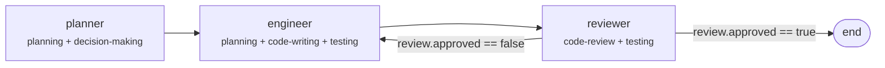

<div class="page-hero">
  <h1>Live Demo</h1>
  <p>See a compiled pipeline in action. This graph shows the execution flow the compiler produces from a <code>dev-team</code> config.</p>
</div>

<div class="demo-hints">

**How to interact:**
- **Click a node** to see its skill composition, state reads/writes, and description
- **Drag** to pan around the graph
- **Scroll** to zoom in and out
- Conditional branches show their `when` clause on the edge labels

</div>

<iframe src="/skillfold/demo-graph.html" width="100%" height="500" style="border: 1px solid var(--vp-c-divider); border-radius: 8px;" allow="clipboard-write"></iframe>

<details>
<summary>Can't see the graph? Here's the static flow diagram:</summary>



</details>

::: tip Generate this for your own pipeline
```bash
npx skillfold graph --html > pipeline.html
```
Open `pipeline.html` in a browser to get the same interactive view for any config.
:::

## Quick Start

Scaffold a pipeline, compile it, and see the output in under 30 seconds:

```bash
# Scaffold from a template
npx skillfold init my-team --template dev-team
cd my-team

# Compile to standard SKILL.md files
npx skillfold

# Or compile directly to Claude Code agents
npx skillfold --target claude-code

# Visualize the flow
npx skillfold graph --html > pipeline.html
```

## Example Config

This is the `dev-team` template config that generates the graph above:

```yaml
name: dev-team

imports:
  - npm:skillfold/library/skillfold.yaml

skills:
  composed:
    planner:
      compose: [planning, decision-making]
      description: "Analyzes the goal and produces a structured plan."

    engineer:
      compose: [planning, code-writing, testing]
      description: "Implements the plan by writing production code and tests."

    reviewer:
      compose: [code-review, testing]
      description: "Reviews code for correctness, clarity, and test coverage."

    orchestrator:
      compose: [planning]
      description: "Coordinates pipeline execution."

state:
  Review:
    approved: bool
    feedback: string

  plan:
    type: string
  implementation:
    type: string
  review:
    type: Review

team:
  orchestrator: orchestrator

  flow:
    - planner:
        writes: [state.plan]
      then: engineer

    - engineer:
        reads: [state.plan]
        writes: [state.implementation]
      then: reviewer

    - reviewer:
        reads: [state.implementation]
        writes: [state.review]
      then:
        - when: review.approved == false
          to: engineer
        - when: review.approved == true
          to: end
```

## What the Compiler Produces

Running `npx skillfold` on this config generates four SKILL.md files:

| Agent | Composed From | Description |
|-------|--------------|-------------|
| `planner` | planning + decision-making | Plans and makes key decisions |
| `engineer` | planning + code-writing + testing | Writes code and tests |
| `reviewer` | code-review + testing | Reviews code quality |
| `orchestrator` | planning + generated execution plan | Coordinates the flow |

The `engineer` agent's SKILL.md contains the bodies of `planning`, `code-writing`, and `testing` concatenated in order - no duplication, no drift.

## Try the Builder

Want to edit configs interactively? The [Pipeline Builder](/builder) lets you modify YAML and see the graph update in real time.
