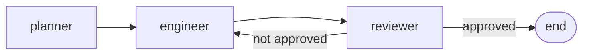
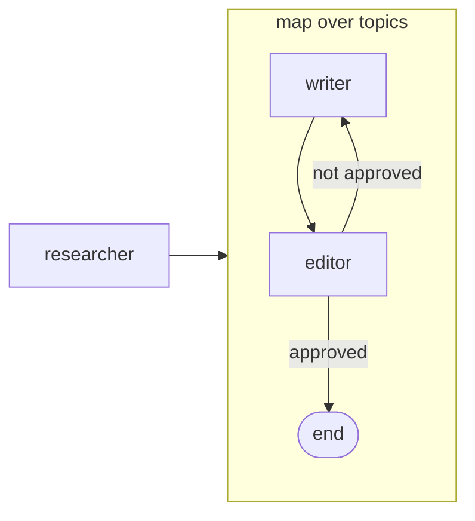
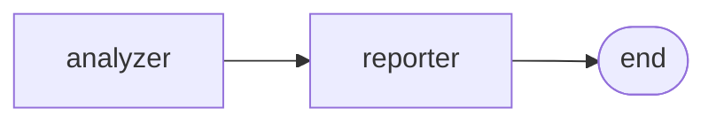

# Examples

Skillfold ships with three starter templates in the shared skills library. Each demonstrates a different pipeline pattern and can be scaffolded with a single command. All templates import the [11 built-in library skills](/library), so you can start composing agents immediately.

<div class="stat-pills">
  <span class="stat-pill"><strong>3</strong> templates</span>
  <span class="stat-pill"><strong>11</strong> library skills</span>
  <span class="stat-pill"><strong>0</strong> config needed</span>
</div>

::: tip Standalone installation
Don't need a full pipeline? Install any library skill individually with `npx skills add byronxlg/skillfold -s <skill-name>`. See the [Library Skills](/library) page for the full list.
:::

## dev-team <Badge type="tip" text="Linear + Loop" />

A linear pipeline with a review loop. Three agents - planner, engineer, reviewer - pass work forward in sequence. The reviewer can approve and end the pipeline or send feedback back to the engineer, creating a revision cycle.

**Scaffold this template:**

```bash
npx skillfold init my-project --template dev-team
```

**Config:**

```yaml
name: dev-team

imports:
  - npm:skillfold/library/skillfold.yaml

skills:
  composed:
    planner:
      compose: [planning, decision-making]
      description: "Analyzes the goal and produces a structured plan with key decisions."
    engineer:
      compose: [planning, code-writing, testing]
      description: "Implements the plan by writing production code and tests."
    reviewer:
      compose: [code-review, testing]
      description: "Reviews code for correctness, clarity, and test coverage."

state:
  Review:
    approved: bool
    feedback: string
  plan:
    type: string
  implementation:
    type: string
  review:
    type: Review

team:
  flow:
    - planner:
        writes: [state.plan]
      then: engineer
    - engineer:
        reads: [state.plan]
        writes: [state.implementation]
      then: reviewer
    - reviewer:
        reads: [state.implementation]
        writes: [state.review]
      then:
        - when: review.approved == true
          to: end
        - when: review.approved == false
          to: engineer
```

**Compiled agents:**

| Agent | Composed from | Description |
|-------|---------------|-------------|
| planner | planning, decision-making | Analyzes the goal and produces a structured plan with key decisions. |
| engineer | planning, code-writing, testing | Implements the plan by writing production code and tests. |
| reviewer | code-review, testing | Reviews code for correctness, clarity, and test coverage. |

**Flow:**



---

## content-pipeline <Badge type="warning" text="Parallel Map" />

A parallel map pattern over a dynamic list. The researcher produces a list of topics, then writer and editor process each topic in parallel. Each topic has its own revision loop where the editor can send a draft back to the writer.

**Scaffold this template:**

```bash
npx skillfold init my-project --template content-pipeline
```

**Config:**

```yaml
name: content-pipeline

imports:
  - npm:skillfold/library/skillfold.yaml

skills:
  composed:
    researcher:
      compose: [research, planning]
      description: "Researches a subject and produces a list of topics to cover."
    writer:
      compose: [research, writing]
      description: "Drafts content for a given topic with supporting research."
    editor:
      compose: [summarization, writing]
      description: "Reviews and refines drafted content for clarity and completeness."

state:
  Topic:
    title: string
    draft: string
    approved: bool
  topics:
    type: list<Topic>

team:
  flow:
    - researcher:
        writes: [state.topics]
      then: map
    - map:
        over: state.topics
        as: topic
        flow:
          - writer:
              reads: [topic.title]
              writes: [topic.draft]
            then: editor
          - editor:
              reads: [topic.draft]
              writes: [topic.approved]
            then:
              - when: topic.approved == true
                to: end
              - when: topic.approved == false
                to: writer
```

**Compiled agents:**

| Agent | Composed from | Description |
|-------|---------------|-------------|
| researcher | research, planning | Researches a subject and produces a list of topics to cover. |
| writer | research, writing | Drafts content for a given topic with supporting research. |
| editor | summarization, writing | Reviews and refines drafted content for clarity and completeness. |

**Flow:**



---

## code-review-bot <Badge type="info" text="Minimal" />

A minimal two-agent flow with no loops or branching. The analyzer reads code and finds issues, then the reporter produces a structured summary. This is a good starting point for simple pipelines that don't need conditional routing.

**Scaffold this template:**

```bash
npx skillfold init my-project --template code-review-bot
```

**Config:**

```yaml
name: code-review-bot

imports:
  - npm:skillfold/library/skillfold.yaml

skills:
  composed:
    analyzer:
      compose: [code-review, file-management]
      description: "Reads code files and analyzes them for issues."
    reporter:
      compose: [writing, summarization]
      description: "Produces a structured report from code review findings."

state:
  findings:
    type: string
  report:
    type: string

team:
  flow:
    - analyzer:
        writes: [state.findings]
      then: reporter
    - reporter:
        reads: [state.findings]
        writes: [state.report]
      then: end
```

**Compiled agents:**

| Agent | Composed from | Description |
|-------|---------------|-------------|
| analyzer | code-review, file-management | Reads code files and analyzes them for issues. |
| reporter | writing, summarization | Produces a structured report from code review findings. |

**Flow:**



---

## Build your own

These templates are starting points. To create a custom pipeline from scratch, follow the [Getting Started](/getting-started) guide. You can mix library skills with your own atomic skills, define custom state types, and wire agents into any flow pattern that fits your use case.
